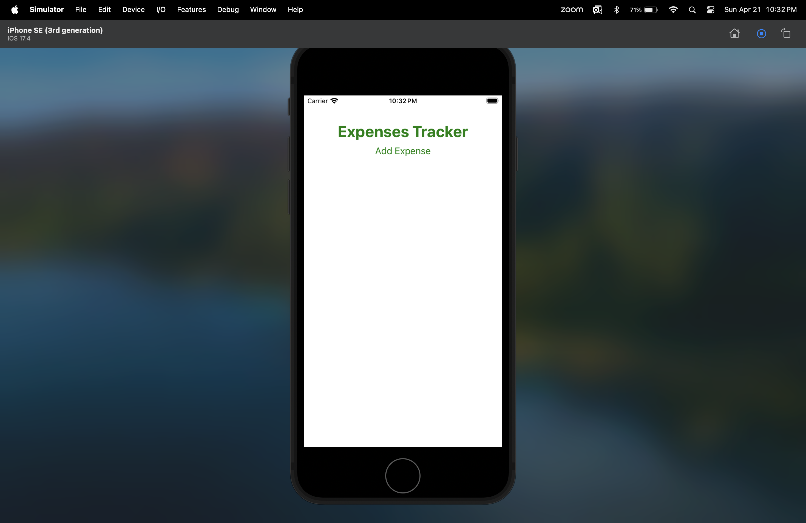
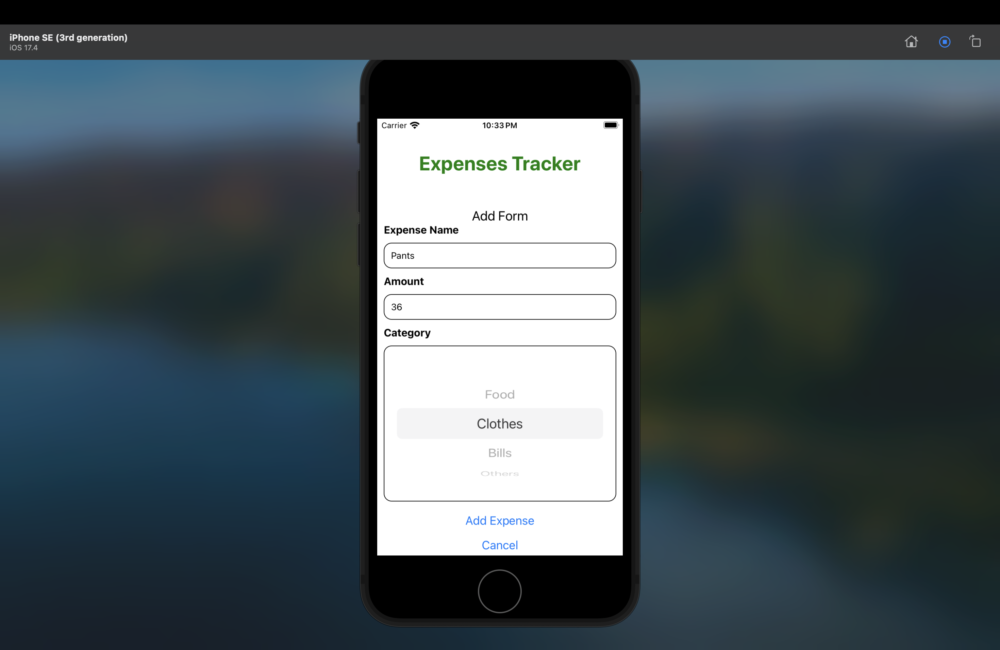
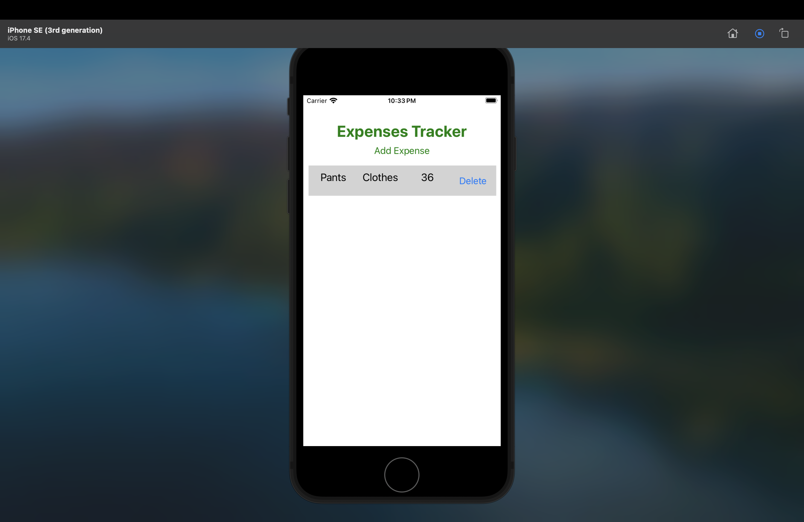
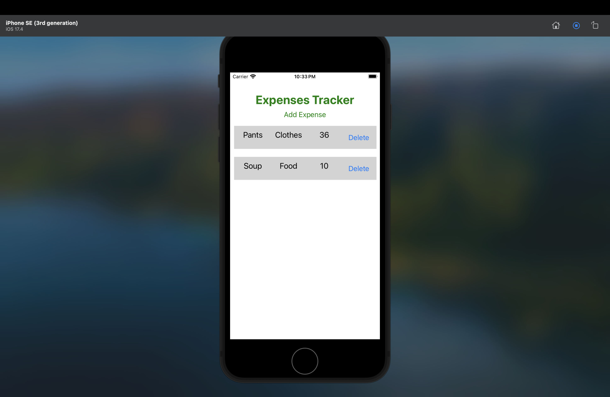

# Expense-Tracker-App

### Personal mobile App Project Final

### Name of the Students
1. Revanth Reddy K
2. sreeja chakka

#App overview 

This expenditure monitoring application is designed to streamline the effective administration of everyday spending. Created to tackle the issue of efficiently tracking daily costs, this tool provides users with a handy option for monitoring their spending patterns. The program incorporates different libraries, such as React Navigation for seamless navigation and AsyncStorage for persistent data storage, using React Native. The application is composed of two major screens: the primary page for commencing the monitoring of costs, and an additional screen for inputting new charges. Users have the ability to classify expenses and access a record of past entries, allowing them to monitor their expenditures and efficiently handle their budgets. The app's intuitive design guarantees smooth user engagement, while its data durability function assures the preservation of spending details across sessions. Overall, it offers customers a simple and effective tool for tracking costs and managing their financial well-being.

# Video Link

[https://drive.google.com/file/d/1zrbN295nPBs89BYKJH2dcjsIutOT1x5U/view?usp=sharing](https://drive.google.com/file/d/1zrbN295nPBs89BYKJH2dcjsIutOT1x5U/view?usp=sharing)

#  working App Screenshots

### 1. Home Screen 

--> This is the main screen of the app where it shows Expenses Tracker where you can start tracking the expenses with the the help add expense option below.



### 2. Add Expenses

--> In this page it will display the expense form where it allows the user to fill the expense name and amount spent and also you can select the category of the expense.


### 3. Filling the form

--> In this stage you will fill the name of the expense and enter the amount and select the category of expense such as Food, Clothes, Bills and other.



### 4. Record of entries

--> The expenses record is displayed which you had filled in the prvious step where you can track the expenses.



### 5. Multiple entries

--> Multiple expenses are dispayed which you had entered and you can view all the expenses from different categories which you have entered and track them easily and also allows you to delete the expense if you don't need it.




## Required Dependencies

```
"dependencies": {
    "@react-native-picker/picker": "2.6.1",
    "expo": "~50.0.14",
    "expo-status-bar": "~1.11.1",
    "react": "18.2.0",
    "react-native": "0.73.6",
    "react-native-chart-kit": "^6.12.0"
```

